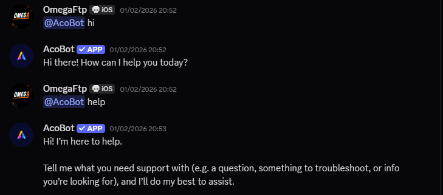

# 🤖 AcoBot – Verified AI Discord Chatbot

  
  
  
  

---

## 🚀 About AcoBot

**AcoBot** is a powerful AI-powered Discord chatbot designed to deliver intelligent conversations, productivity assistance, and smart automation directly inside your Discord server.

🛡 **AcoBot is a Discord Verified Bot**, meaning it has passed Discord’s verification requirements and is trusted to operate across large communities.

It understands natural language, responds intelligently, and enhances engagement in any server.

---

# 🔗 Invite AcoBot

Add AcoBot to your server using the official authorization link:

👉 **[Invite AcoBot Now](https://discord.com/oauth2/authorize?client_id=1156403825297600632&permissions=274877910016&integration_type=0&scope=bot)**

> You must have **Manage Server** permission to add the bot.

---

## ✨ Features

- 🧠 Advanced AI-based intelligent replies  
- 💬 Natural language understanding  
- ⚡ Fast & optimized response system  
- 🛡 Verified & secure architecture  
- 🌍 Multi-server support  
- 🎯 Mention-based interaction system  
- 📊 Designed for community engagement  
- 🔄 Continuous improvements & updates  

---

## 🗨 How to Interact with AcoBot

Using AcoBot is simple and intuitive.

### Step 1️⃣ – Mention the Bot

Just mention the bot in any channel:

### Step 2️⃣ – Get Instant AI Response

AcoBot automatically detects the mention and replies intelligently in the same channel.

No prefixes.  
No complicated commands.  
Just mention and chat.

---

## 📸 Screenshots

### 💬 AI Conversation Example

---
